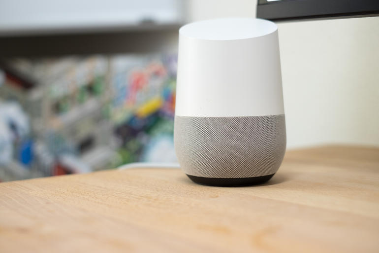
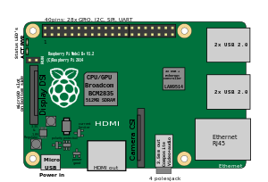
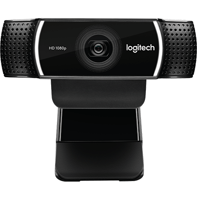
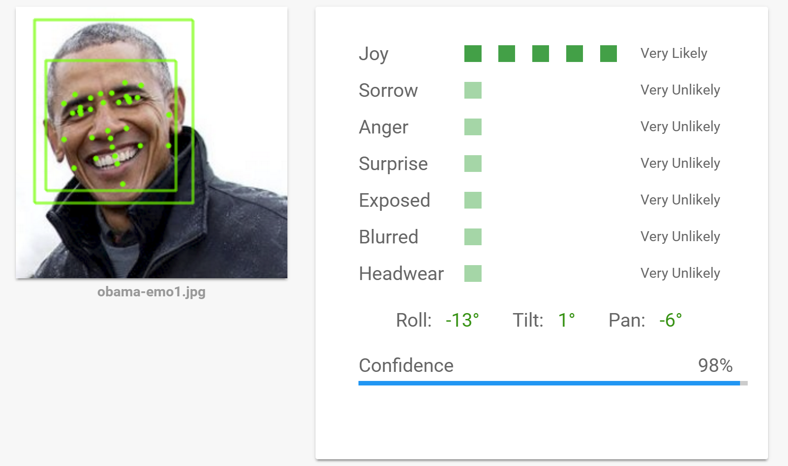
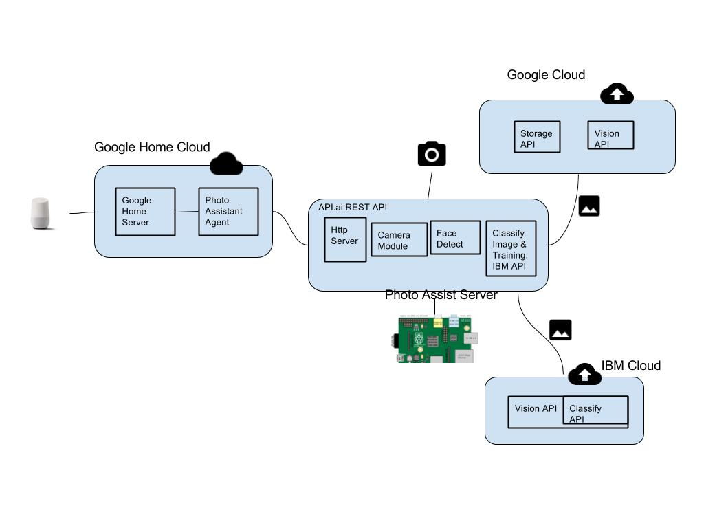

# Personal Photographer with GoogleHome.
  'Personal Photographer' is a voice controlled photo assistant application developed using google home frameworks. I have build this as a fun project to take family portraits without having someone manually operating the camera  and best part is no family member has to be left out. Also, I would like to learn API.AI, cloud vision API's for vision processing.

  I started with API.AI google framework to train voice commands and relay the action commands to this nodejs server controlling the camera. After the picture is taken, used cloud vision API for 'face detection' available from Google and IBM.

# Demo
 |
 |
 |
 |

# Overview

# Install
> ngrok http 3000  
> git clone (this repo)  
> cd (this repo)  
> npm install  
> npm start or node server  
> login to API.API and add ngrok link in webhook fulfill

